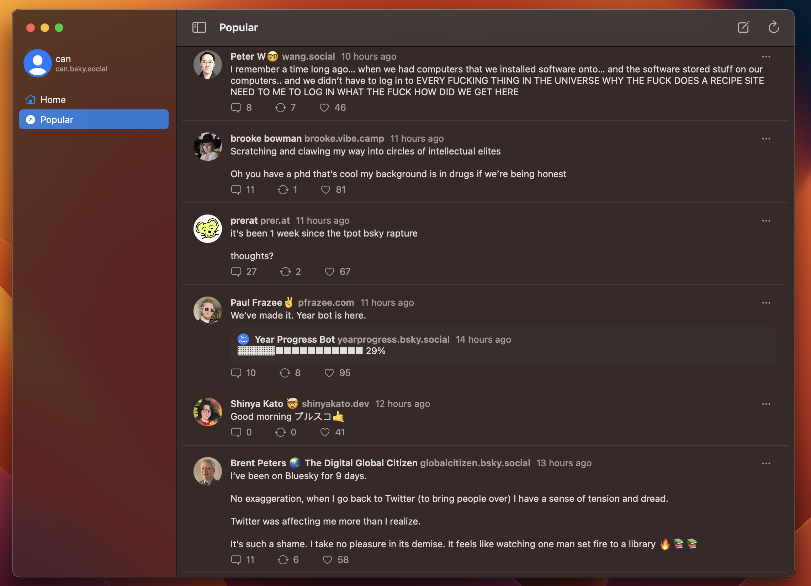
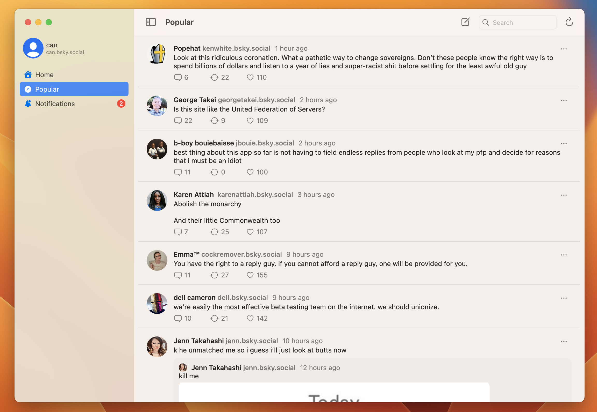

# swiftsky
An unofficial Bluesky/ATProto client for macOS Ventura built in SwiftUI

 

# Warning
This project is incomplete and not recommended for daily use.

# Download
Download latest alpha [release](https://github.com/rmcan/swiftsky/releases/latest)

# Requirements
macOS 13.3+

# Building
Xcode 14+
